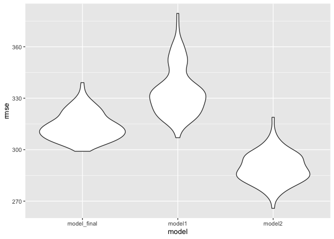

HW6
================
Yushan Wang

## Problem 1

### Load and clean data

``` r
df = read.csv("data/birthweight.csv") 
```

check if there is **missing values**

``` r
skimr::skim(df)$n_missing
```

    ##  [1] 0 0 0 0 0 0 0 0 0 0 0 0 0 0 0 0 0 0 0 0

There is **no missing value** for any of the variables

**Convert numeric to factor** where appropriate

``` r
df = 
  df %>% mutate(
  babysex = as.factor(babysex),
  frace = as.factor(frace),
  malform = as.factor(malform),
  mrace = as.factor(mrace),
)
```

### Propose a regression model

To start with, I would like to **examine collinearity** between
variables. The variable `bwt` is removed because it is the dependent
variable

``` r
df_cor = df %>% 
  select(-bwt)

model.matrix(~0+., data = df_cor) %>% 
  cor(use="pairwise.complete.obs") %>% 
  ggcorrplot(show.diag = F, type="lower", lab=TRUE, lab_size=2)
```

<!-- -->

Based on the correlation plot:

1: father’s race and mother’s race are highly correlated;

2: mother’s weight at delivery, mother’s pre-pregnancy weight and
mother’s pre-pregnancy BMI are highly correlated;

3.baby’s head circumference at birth and baby’s length at birth are
correlated.

As such, the variables `frace`,`ppwt`, `bhead` will be kept. The rest of
the variables will be removed due to multicollinearity.

``` r
df_sub = df %>% 
  select(-c(mrace, delwt, ppbmi, blength))
```

**Build preliminary model** using variables from collinearity analysis

``` r
model = lm(bwt ~ ., data = df_sub)
summary(model) %>% 
  broom::tidy() %>% 
  knitr::kable()
```

| term        |      estimate |   std.error |   statistic |   p.value |
|:------------|--------------:|------------:|------------:|----------:|
| (Intercept) | -5303.8023943 | 159.0459150 | -33.3476178 | 0.0000000 |
| babysex2    |    21.6725862 |   9.7210568 |   2.2294475 | 0.0258353 |
| bhead       |   197.9797530 |   3.3708148 |  58.7335002 | 0.0000000 |
| fincome     |     0.0519204 |   0.2059556 |   0.2520951 | 0.8009795 |
| frace2      |  -169.5315182 |  11.7226718 | -14.4618498 | 0.0000000 |
| frace3      |   -52.7539638 |  47.3673499 |  -1.1137200 | 0.2654612 |
| frace4      |  -121.7658057 |  22.0056312 |  -5.5333930 | 0.0000000 |
| frace8      |   -68.6533050 |  84.1046637 |  -0.8162842 | 0.4143826 |
| gaweeks     |    20.0359008 |   1.6630175 |  12.0479192 | 0.0000000 |
| malform1    |   -31.8204090 |  81.1308798 |  -0.3922108 | 0.6949218 |
| menarche    |    -5.6227438 |   3.3233223 |  -1.6919045 | 0.0907362 |
| mheight     |    12.0954042 |   2.0578646 |   5.8776481 | 0.0000000 |
| momage      |     0.2253067 |   1.4009747 |   0.1608214 | 0.8722416 |
| parity      |    75.9669011 |  46.4982924 |   1.6337568 | 0.1023827 |
| ppwt        |     1.9381349 |   0.2704090 |   7.1674213 | 0.0000000 |
| smoken      |    -6.6014144 |   0.6711619 |  -9.8358007 | 0.0000000 |
| wtgain      |     5.4964505 |   0.4514289 |  12.1756724 | 0.0000000 |

According to the p.value, at significant level of 0.05, the variables
`fincome`, `frace3`, `frace8`, `malform`, `menarche`, `momage`, `parity`
are not significant.

I decide to keep `frace` variable, because some category in this
variable is still significant.

Therefore, the variables `fincome`, `malform`, `menarche`, `momage`,
`parity` are removed for modeling.

**Build final model**

``` r
df_sub2 = df_sub %>% 
  select(-c(fincome, malform, menarche, momage, parity))

model_final = lm(bwt ~ ., data = df_sub2)
summary(model_final) %>% 
  broom::tidy() %>% 
  knitr::kable()
```

| term        |     estimate |   std.error |   statistic |   p.value |
|:------------|-------------:|------------:|------------:|----------:|
| (Intercept) | -5341.907362 | 156.0069540 | -34.2414695 | 0.0000000 |
| babysex2    |    22.218046 |   9.7112850 |   2.2878585 | 0.0221937 |
| bhead       |   198.026576 |   3.3701007 |  58.7598390 | 0.0000000 |
| frace2      |  -171.503695 |  10.5909638 | -16.1933982 | 0.0000000 |
| frace3      |   -57.794802 |  46.9280616 |  -1.2315617 | 0.2181797 |
| frace4      |  -124.548761 |  21.7037549 |  -5.7385813 | 0.0000000 |
| frace8      |   -70.943048 |  83.9932899 |  -0.8446276 | 0.3983655 |
| gaweeks     |    19.831969 |   1.6543666 |  11.9876507 | 0.0000000 |
| mheight     |    11.684314 |   2.0350905 |   5.7414225 | 0.0000000 |
| ppwt        |     1.996262 |   0.2659637 |   7.5057692 | 0.0000000 |
| smoken      |    -6.642011 |   0.6706120 |  -9.9044029 | 0.0000000 |
| wtgain      |     5.543886 |   0.4482817 |  12.3669693 | 0.0000000 |

**Plot of model residuals against fitted values**

``` r
df_sub2 %>% 
  add_predictions(model_final) %>% 
  add_residuals(model_final) %>% 
  ggplot(aes(x = pred, y = resid, color = pred)) +
  labs(
    title = "Plot of model residuals against fitted values", 
    x = "Predicted values",
    y = "Residuals"
  ) + 
  geom_point(alpha = 0.2) 
```

<!-- -->

### Compare my model to two others

Model using length at birth and gestational age as predictors:

``` r
model1 = lm(bwt ~ blength + gaweeks, data = df)
```

Model using head circumference, length, sex, and all interactions
(including the three-way interaction) between these

``` r
model2 = lm(bwt ~ bhead + blength + babysex 
            + bhead * blength 
            + bhead * babysex
            + blength * babysex
            + bhead * blength * babysex
              , data = df)
```

**Make this comparison in terms of the cross-validated prediction
error**

``` r
cv_df = 
  crossv_mc(df, 100) %>% 
  mutate(
    train = map(train, as_tibble),
    test = map(test, as_tibble))%>% 
  mutate(
    model_final  = map(.x = train, ~lm(bwt ~ babysex + bhead + frace + gaweeks + mheight + ppwt + smoken + wtgain, data = .x)),
    model1  = map(.x = train, ~lm(bwt ~ blength + gaweeks, data = .x)),
    model2  = map(.x = train, ~lm(bwt ~ bhead + blength + babysex 
            + bhead * blength 
            + bhead * babysex
            + blength * babysex
            + bhead * blength * babysex
              , data = .x))) %>% 
  mutate(
    rmse_model_final = map2_dbl(model_final, test, ~rmse(model = .x, data = .y)),
    rmse_model1 = map2_dbl(model1, test, ~rmse(model = .x, data = .y)),
    rmse_model2 = map2_dbl(model2, test, ~rmse(model = .x, data = .y)))
```

``` r
cv_plot = 
  cv_df %>% 
  select(starts_with("rmse")) %>% 
  pivot_longer(
    everything(),
    names_to = "model", 
    values_to = "rmse",
    names_prefix = "rmse_") %>% 
  mutate(model = fct_inorder(model)) %>% 
  ggplot(aes(x = model, y = rmse)) + geom_violin()

cv_plot
```

<!-- -->

It can be concluded from the violin plot and rmse values that my model
fits better than the model with length at birth and gestational age as
predictors; It fits worse than the model with interaction terms. The
model with interaction terms fits the best among the three models due to
small rmse values.

## Problem 2

load data

``` r
weather_df = 
  rnoaa::meteo_pull_monitors(
    c("USW00094728"),
    var = c("PRCP", "TMIN", "TMAX"), 
    date_min = "2017-01-01",
    date_max = "2017-12-31") %>%
  mutate(
    name = recode(id, USW00094728 = "CentralPark_NY"),
    tmin = tmin / 10,
    tmax = tmax / 10) %>%
  select(name, id, everything())
```

    ## Registered S3 method overwritten by 'hoardr':
    ##   method           from
    ##   print.cache_info httr

    ## using cached file: ~/Library/Caches/R/noaa_ghcnd/USW00094728.dly

    ## date created (size, mb): 2021-10-05 15:40:14 (7.602)

    ## file min/max dates: 1869-01-01 / 2021-10-31

### Bootstrap

Use 5000 bootstrap samples and, for each bootstrap sample, produce
estimates of these two quantities

``` r
weather_boot = 
  weather_df %>% 
  modelr::bootstrap(n = 5000) %>% 
  mutate(
    models = map(strap, ~lm(tmax ~ tmin, data = .x) ),
    results_log = map(models, broom::tidy),
    results_r = map(models, broom::glance)
    ) %>% 
  select(-strap, -models) %>% 
  unnest(results_r) %>% 
  select(.id, results_log, r.squared) %>% 
  unnest(results_log) %>% 
  group_by(.id) %>% 
  summarize(
    r.squared = r.squared,
    log = log(prod(estimate))
    ) %>% 
  unique() %>% 
  ungroup()
```

    ## `summarise()` has grouped output by '.id'. You can override using the `.groups` argument.

**Distribution of r squared estimates**

``` r
weather_boot %>% 
  ggplot(aes(x = r.squared)) + 
  geom_density() +
  labs(
    title = "Distribution of r squared esitimates",
    x = "r squared estimates")
```

<!-- -->

From the plot, we see that the r squared estimates mostly lays around
0.9. The distribution is left-skewed.

**Distribution of log(beta0 \* beta1) estimates**

``` r
weather_boot %>% 
  ggplot(aes(x = log)) + 
  geom_density() +
  labs(
    title = "Distribution of log(beta0 * beta1) esitimates",
    x = "log(beta0 * beta1) estimates")
```

<!-- -->

From the plot, we see that the log(beta0 \* beta1) estimates mostly lays
around 2.01. It is overall normally distributed.

**95% Confidence interval for r.squared**

``` r
weather_boot %>%
  summarise(lower = quantile(r.squared, probs = c(0.025)),
            upper = quantile(r.squared, probs = c(0.975))
            ) %>% 
  knitr::kable()
```

|     lower |     upper |
|----------:|----------:|
| 0.8942394 | 0.9274604 |

**95% Confidence interval for log(beta0 \* beta1)**

``` r
weather_boot %>%
  summarise(lower = quantile(log, probs = c(0.025)),
            upper = quantile(log, probs = c(0.975))
            )%>% 
  knitr::kable()
```

|    lower |    upper |
|---------:|---------:|
| 1.964443 | 2.058263 |
